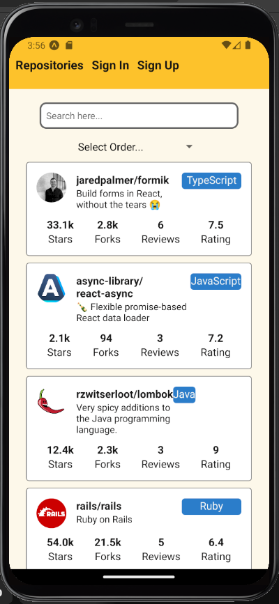
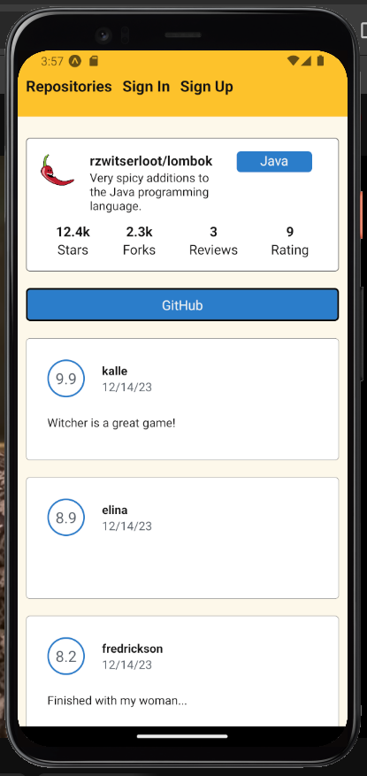
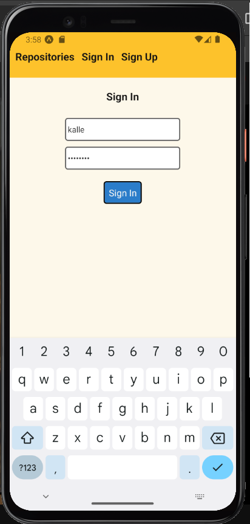
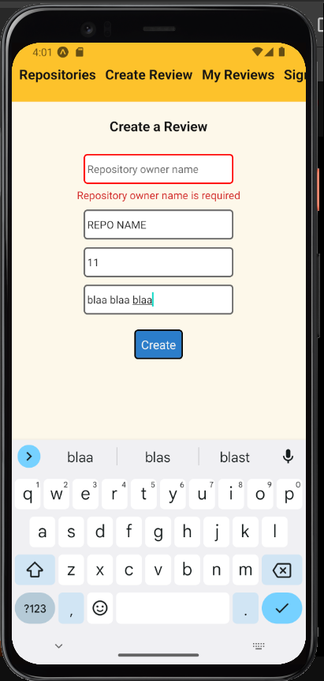
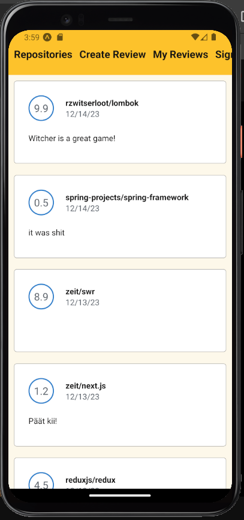

# FULL-STACK-OPEN-PART-10
This directory is for the Full Stack Open - course provided by the University of Helsinki. The application found in the repository covers exercises from part 10 - React Native. The reason why this part of the exercises are in a own Git repository is because it was recommended to do so.

### Author: Taneli Manninen

Here is some screenshots of different views of the app:

### Front Page View

### Single Repository View

### Sign In View

### Create Review View

### My Reviews View

